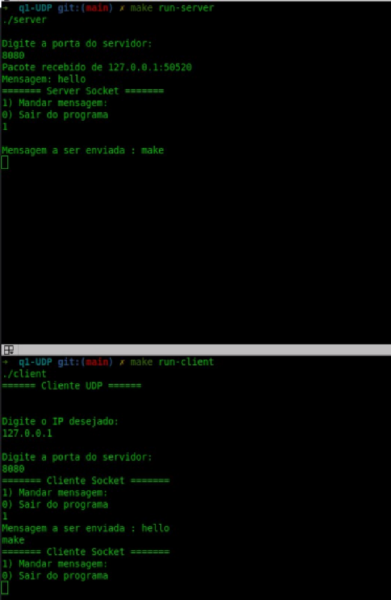
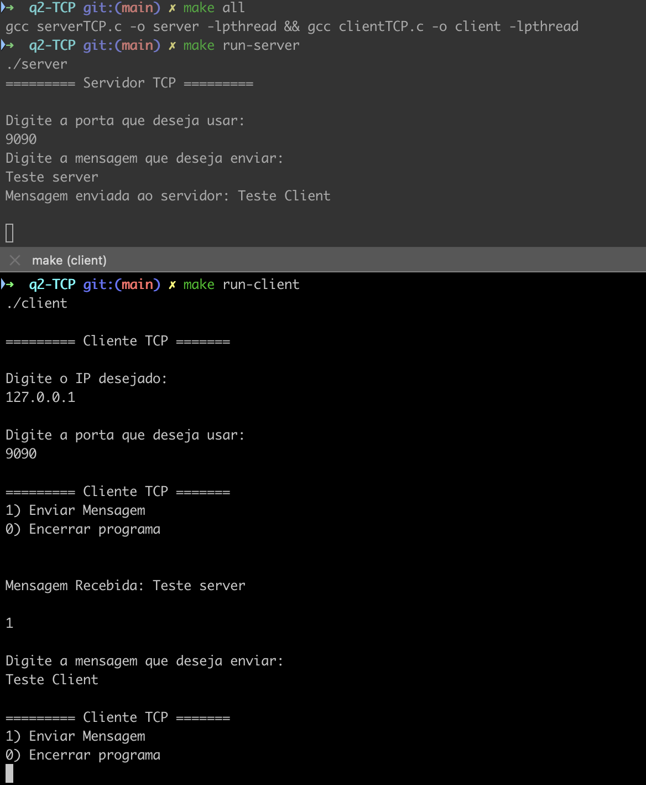
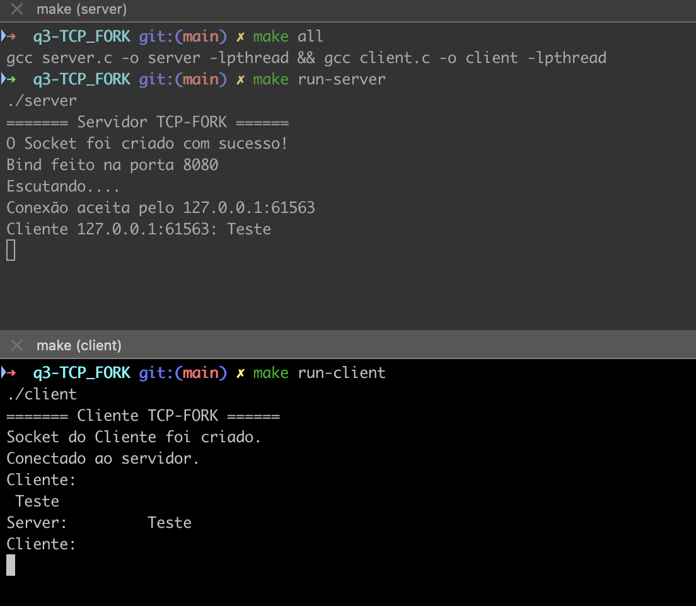
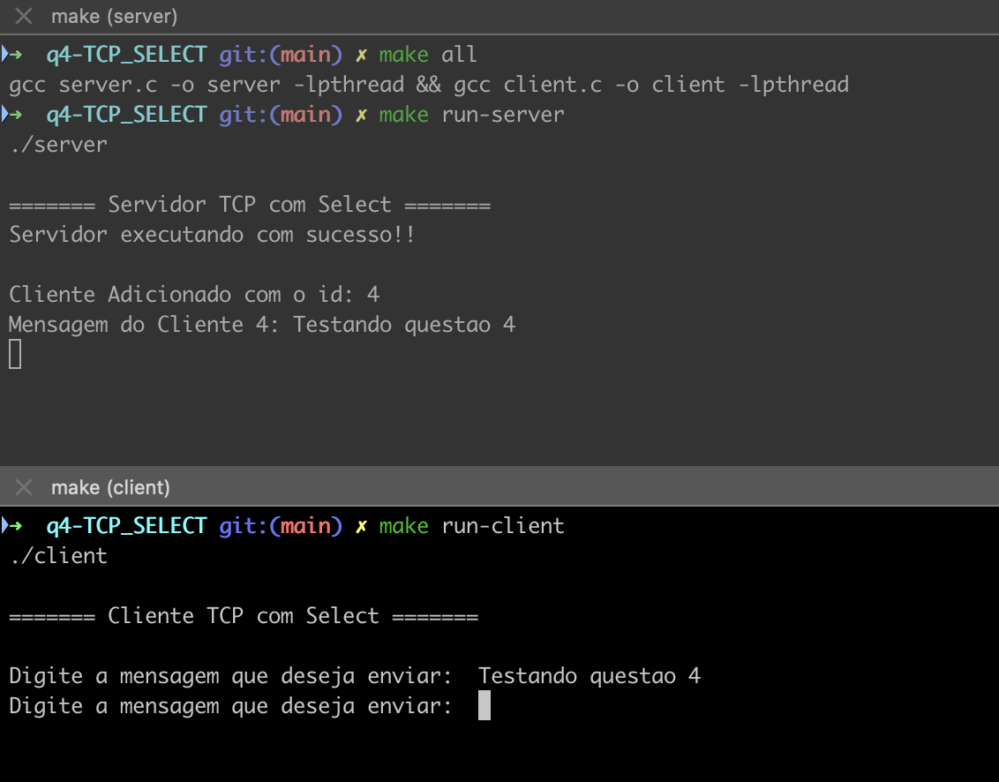

# FUNDAMENTOS DE REDES DE COMPUTADORES

## Alunos

| Aluno | Matrícula |
| ----- |-----------|
| Daniel Maike Mendes Gonçalves | 16/0117003 | 
| Joberth Rogers Tavares Costa | 16/0128013 |

## Utilizando Makefile

Para gerar os executáveis:

1 - ```make all```

Para rodar o servidor:

2 - ```make run-server```

Para rodar o cliente:

3 - ```make run-client```

## Questão 1

Crie uma aplicação UDP simples, cujo fluxo de diálogo entre Cliente e Servidor seja bidirecional. Ou seja, os dois lados (cliente e servidor) enviam e recebem mensagens de um para o outro.



## Questão 2

Crie uma aplicação TCP, para diálogo cliente/servidor, para diálogo bidirecional, cujo lado servidor permaneça com a conexão ativa até que o cliente informe ao servidor que não há mais nada a enviar; quando isso ocorrer, apenas o cliente encerra a conexão, mas o servidor deve continuar ativo, aguardando novas conexões.



## Questão 3

Crie um código TCP, no qual o servidor consiga atender mais de cliente ao mesmo tempo, para promover diálogo bidirecional (half-duplex, ou seja, enquanto um dos lados fala o outro escuta e vice-versa, numa ordem pré-definida), usando a system call fork(). Nos testes de validação, é importante que vários clientes possam dialogar com o servidor, mas não é necessário que clientes dialoguem entre si.



## Questão 4

O aluno deve pesquisar a system call select() e produzir novo código TCP, de modo a implementar um código TCP no qual os clientes se conectem ao servidor TCP e consigam dialogar entre si, num diálogo full-duplex, ou seja, os dois lados podem iniciar o diálogo, sem uma ordem pré-definida. Nesse caso, tudo o que um usuário digitar deve chegar aos pares conectados ao servidor TCP naquele momento. Obs.: Uma referência sobre essa system call pode ser encontrada em https://man7.org/linux/man- pages/man2/select.2.html.


